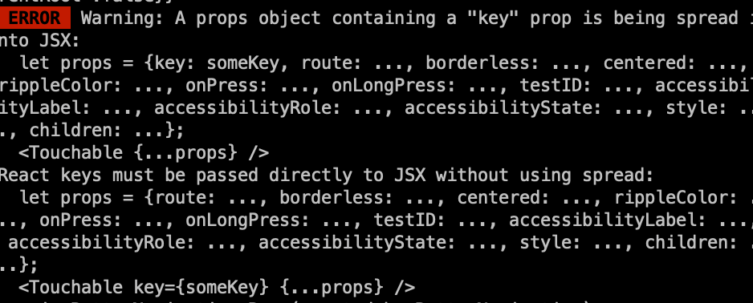

# ShoppingcarServices

## Services

### shoppingcar-service

```
$ nx serve shoppingcar-service --verbose
```
### shoppingcar-web
```
$ nx serve shoppingcar-web --verbose
```
### Shoppingcar-app

```
$ nx start shoppingcar-app --verbose
$ nx run-ios shoppingcar-app --verbose
$ nx run-android shoppingcar-app --verbose
```

# Trouble shotting



```
I made a modification to the "renderTouchable" function in the file and it solved the problem.

To find the file in the project, navigate to:
node_modules/react-native-paper/src/components/BottomNavigation/BottomNavigationBar.tsx

Look for this:

renderTouchable = (props: TouchableProps<Route>) => <Touchable {...props} />,
and replace it with:

renderTouchable = ({ key, ...props }: TouchableProps<Route>) => <Touchable key={key} {...props} />,
```

[Future chore - BottomNavigation: React 18.3 to warn about spreading key props in](https://github.com/callstack/react-native-paper/issues/4401)

## Android build error

[fix error](https://github.com/facebook/react-native/issues/46069#issuecomment-2298066865)

## Redux Devtool

[react-native-get-random-values](https://github.com/LinusU/react-native-get-random-values)
[@redux-devtools/remote](https://github.com/reduxjs/redux-devtools/tree/main/packages/redux-devtools-remote)
[redux-devtool fixed issue](https://github.com/reduxjs/redux-devtools/issues/1382#issuecomment-1615995161)