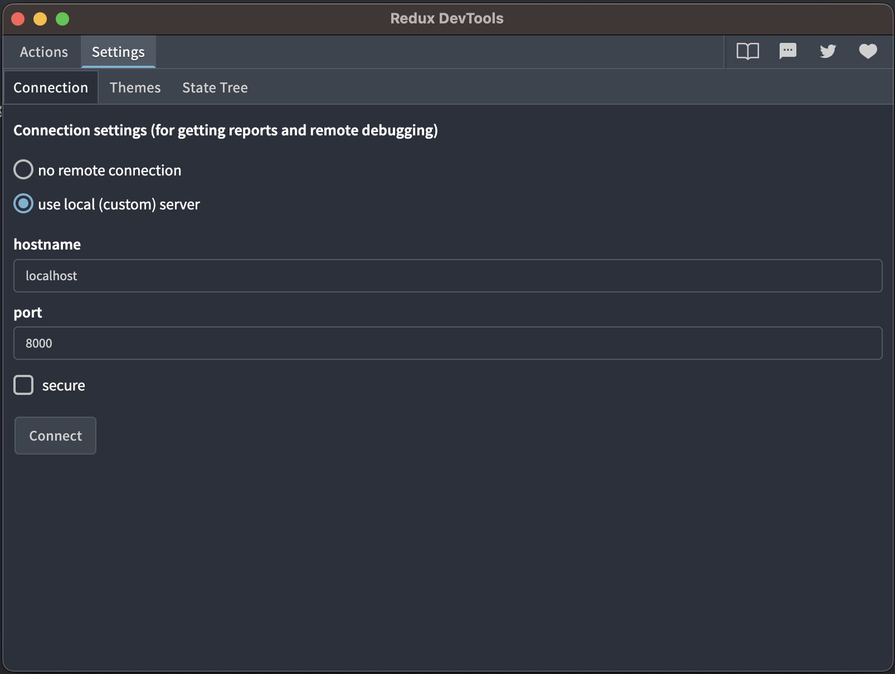

# Install Redux Devtool 

```
$  yarn global add @redux-devtools/cli
```

# Open Redux Devtool

```
$ redux-devtools --open
```

## Set Redux tool custom setting



## ConfigureStore.js

```javascript
import AsyncStorage from '@react-native-async-storage/async-storage';
import {createStore, applyMiddleware, compose} from 'redux';
import {persistStore, persistReducer} from 'redux-persist';
import createSagaMiddleware from 'redux-saga';
import { composeWithDevTools } from '@redux-devtools/remote';

import {
  startFetchingMiddleware,
  stopFetchingMiddleware
} from '../middlewares/fetchHandlerMiddleware';
import { snackbarHandlerMiddleware } from '../middlewares/snackbarHandlerMiddleware';
import rootReducer from '../reducers';
import rootSaga from '../sagas';
import 'react-native-get-random-values';

const persistConfig = {
  key: 'storeCache',
  storage: AsyncStorage,
  blacklist: [],
};

const persistedReducer = persistReducer(persistConfig, rootReducer);

const configureStore = () => {
  const sagaMiddleware = createSagaMiddleware({});
  const middlewares = [startFetchingMiddleware, sagaMiddleware, stopFetchingMiddleware, snackbarHandlerMiddleware];

  const composeEnhancers = __DEV__ ? composeWithDevTools({ hostname: 'localhost', realtime: true, port: 8000 }): compose;
  
  const store = createStore(
    persistedReducer,
    composeEnhancers(applyMiddleware(...middlewares)),
  );

  const persistor = persistStore(store);
  if (__DEV__) {
    module.hot.accept(() => {
      const nextRootReducer = require('../reducers/index').default;
      store.replaceReducer(
        persistReducer(persistConfig, nextRootReducer)
      )
    });
  }
  return {
    persistor,
    store: {
      ...store,
      runSaga: sagaMiddleware.run(rootSaga),
    },
  };
};

const {store, persistor} = configureStore();

export { store, persistor };
```